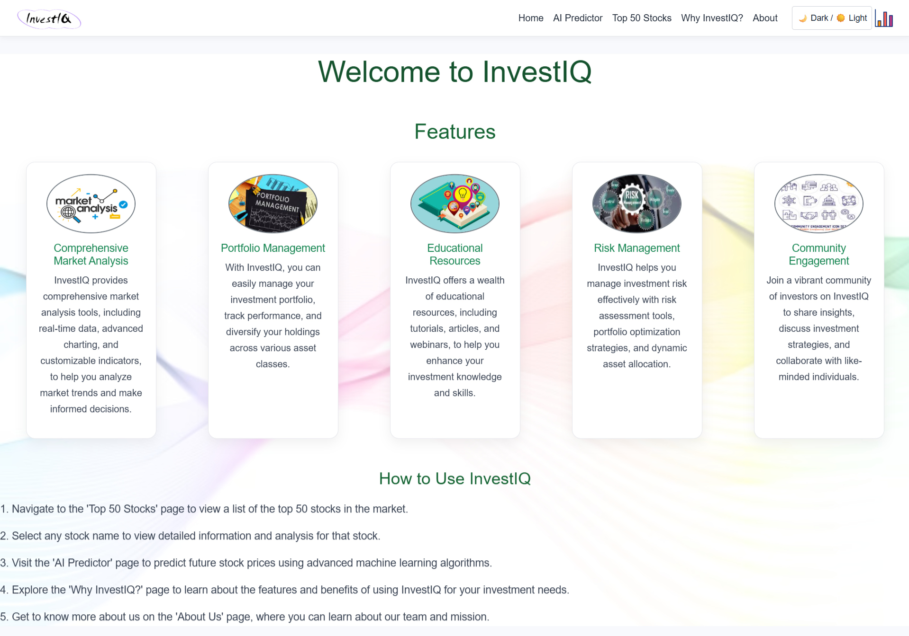
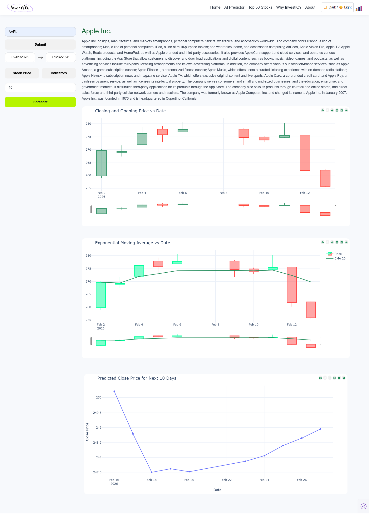
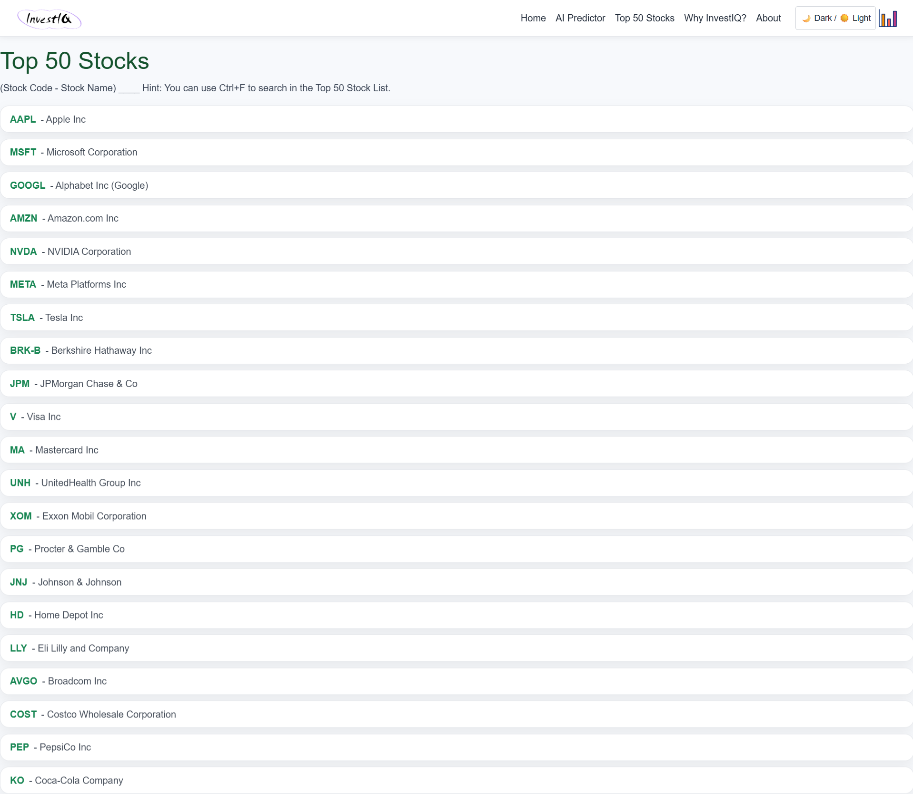
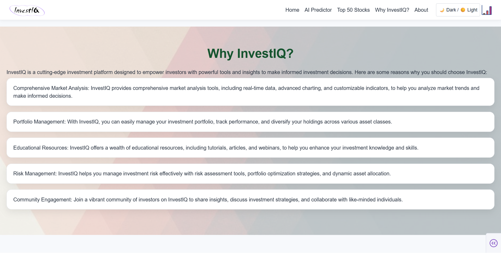
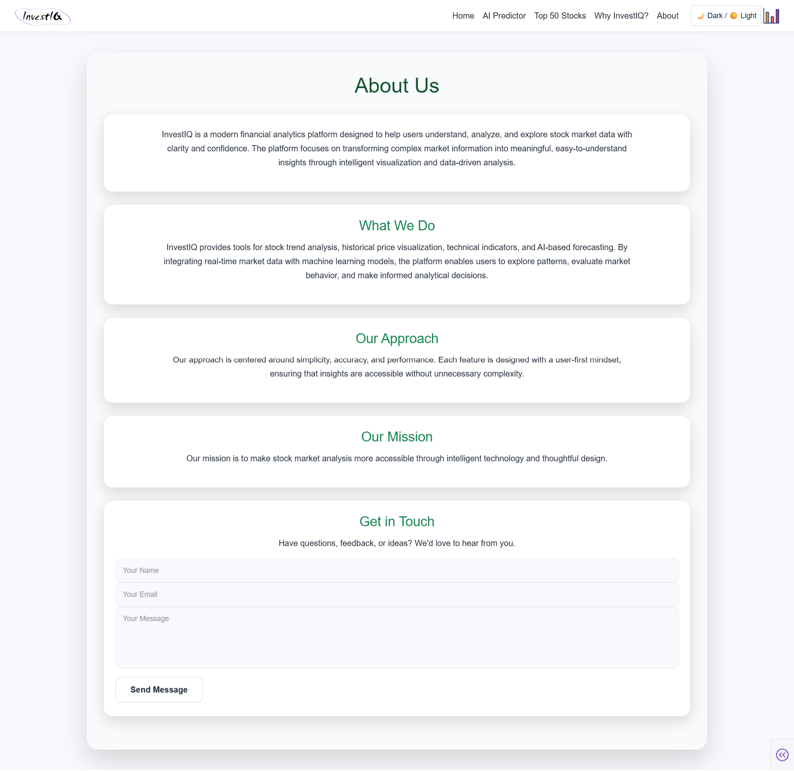

# 📈 InvestIQ  
### 🚀 AI-Powered Stock Market Analytics & Forecasting Platform


---

InvestIQ is a modern financial analytics web application built using **Dash, Plotly, and Machine Learning**.  
It enables users to analyze stock trends, visualize historical data, and forecast future stock prices using AI models.

Designed with a clean UI, dark/light theme toggle, and real-time stock integration.

---

## ✨ Key Features

- 📊 Real-time Stock Data (Yahoo Finance API)
- 📈 Candlestick Chart Visualization
- 📉 Technical Indicators (EMA 20)
- 🤖 AI-Based Multi-step Stock Forecasting
- 🌓 Dark / Light Theme Toggle
- 📅 Interactive Date Range Selection
- 📃 Top 50 US Stocks Listing
- 📩 Contact Form with Email Integration
- 🎨 Fully Themed Modern UI

---

## 🧠 Machine Learning Model

InvestIQ uses:

- Support Vector Regression (SVR)
- Lag Feature Engineering (Previous Close Prices)
- Rolling Mean Feature
- Recursive Multi-step Forecasting
- StandardScaler Normalization

The model predicts future closing prices for selected stocks based on historical patterns.

> ⚠️ Built for educational and analytical purposes only.

---

## 🖼️ Application Screenshots

### 🏠 Home Page
<p align="center">
  
</p>

### 🤖 AI Predictor
<p align="center">
  
</p>

### 📊 Top 50 Stocks
<p align="center">
  
</p>

### 💡 Why InvestIQ?
<p align="center">
  
</p>

### 👤 About Us
<p align="center">
  
</p>

---

## 🛠️ Tech Stack

- 🐍 Python  
- 📊 Dash  
- 📈 Plotly  
- 🎨 Dash Bootstrap Components  
- 🧮 Pandas  
- 🔢 NumPy  
- 🤖 Scikit-learn  
- 📡 Yahoo Finance API  
- 📧 SMTP Email Integration  

---

## 📦 Installation Guide

### 1️⃣ Clone the Repository

```bash
git clone https://github.com/Shahiduddin1710/InvestIQ.git
cd InvestIQ
```

---

### 2️⃣ Install Dependencies

If `requirements.txt` exists:

```bash
pip install -r requirements.txt
```

Or install manually:

```bash
pip install dash dash-bootstrap-components plotly yfinance pandas numpy scikit-learn
```

---

### 3️⃣ Run the Application

```bash
python app.py
```

App will run on:

```
http://127.0.0.1:8050/
```

---

## 📂 Project Structure

```
InvestIQ/
│
├── assets/
│   ├── images...
│
├── snapshots/
│   ├── 1.png
│   ├── 2.png
│   ├── 3.png
│   ├── 4.png
│   └── 5.png
│
├── app.py
├── model.py
├── requirements.txt
└── README.md
```

---

## ⚠️ Disclaimer

This project is created for **educational and analytical purposes only**.  
Stock market predictions are not guaranteed and should not be considered financial advice.

---

## 👨‍💻 Author

**Shahid Uddin Shaikh**  
B.E. Computer Engineering  
Vidyavardhini College of Engineering  

---

## ⭐ Support

If you found this project helpful, consider giving it a ⭐ on GitHub!
