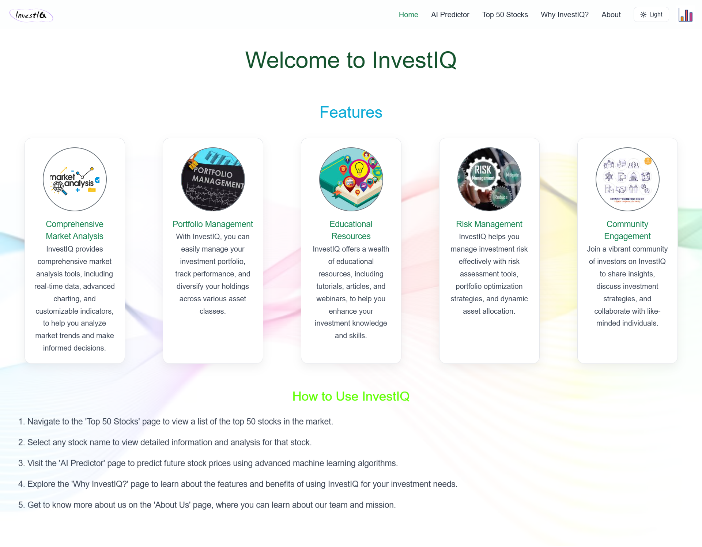
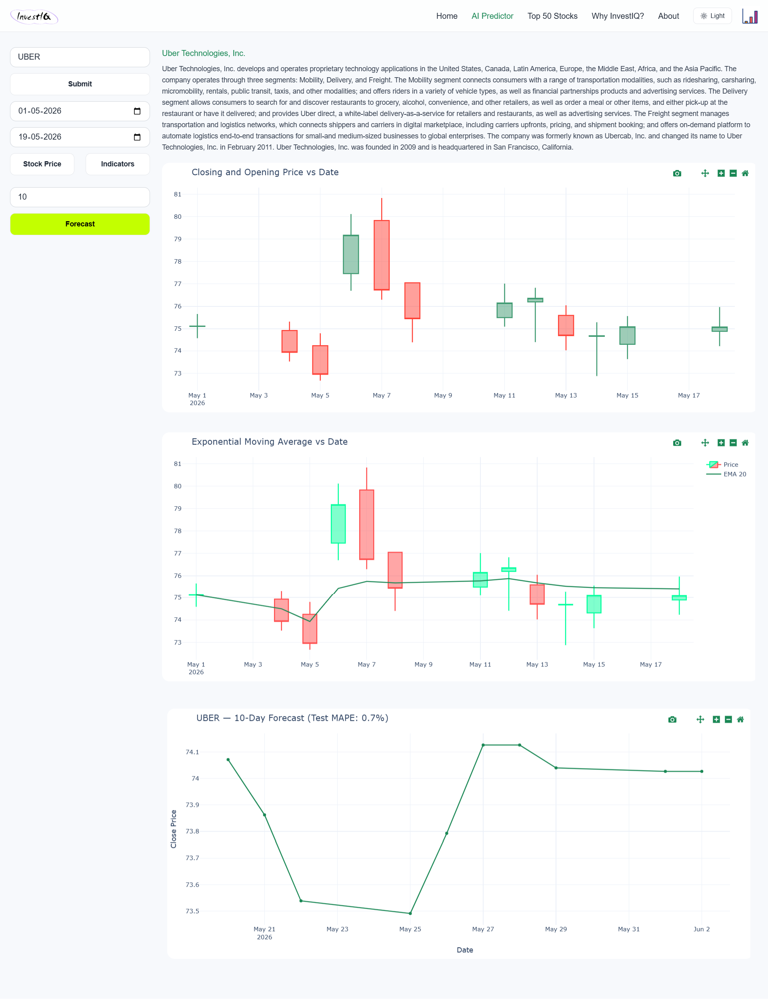
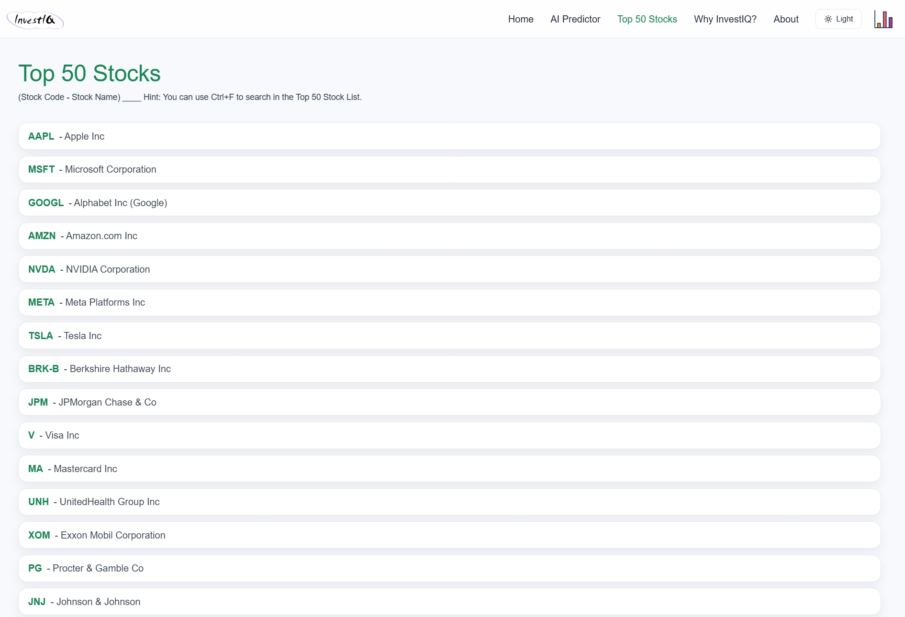
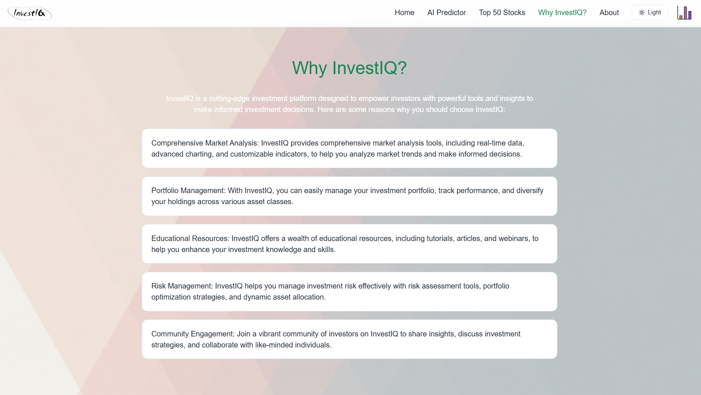
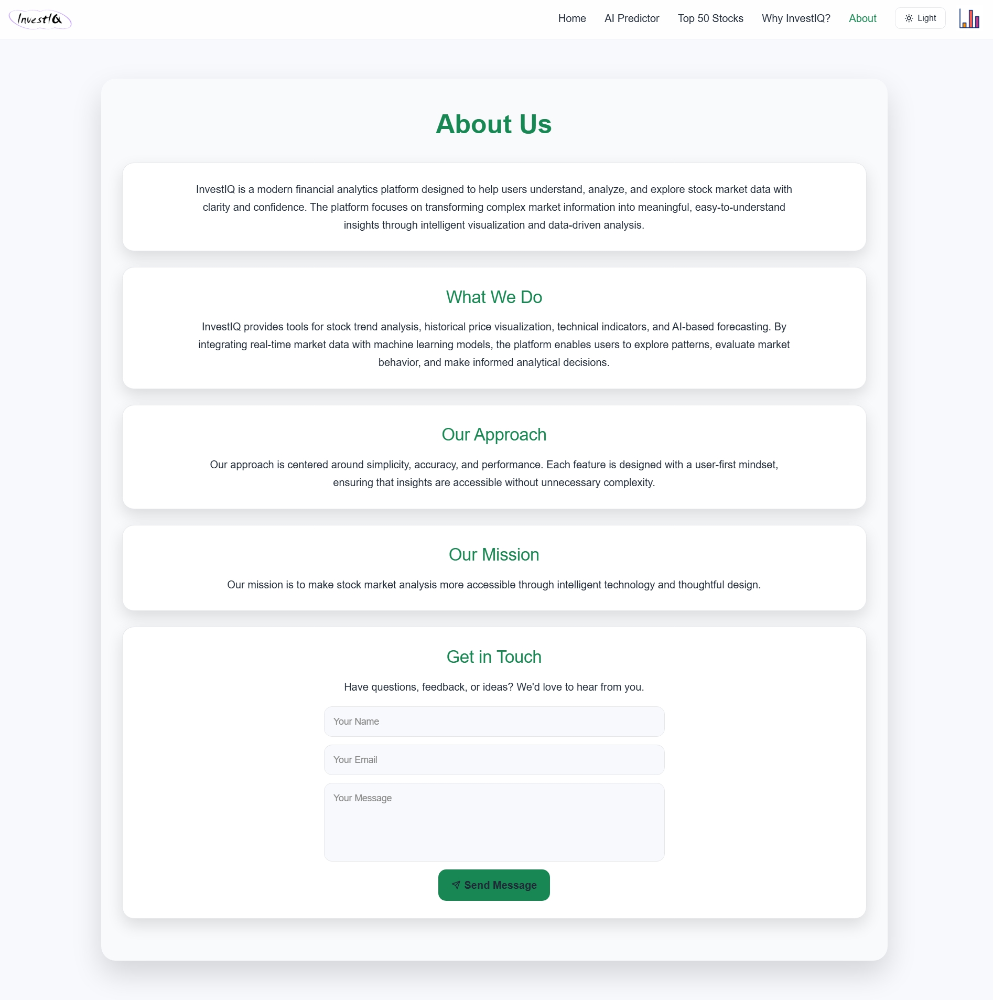

**A modern stock market analytics and AI prediction web application.**

---

## 📌 What is InvestIQ?

InvestIQ is a full-stack stock market analytics platform that allows users to analyze stocks, view candlestick charts, technical indicators, and predict future stock prices using Machine Learning (SVR model). It features a clean dark/light theme, smooth animations, and a responsive layout built for both desktop and mobile.

---

## ✨ Features

- **Candlestick Charts**: View opening and closing prices over any date range
- **Technical Indicators**: EMA 20 and EMA 50 overlaid on price charts
- **AI Forecast**: SVR-based ML model predicting N days into the future with MAPE score
- **Stock Info**: Company name and full business description fetched live
- **Dark / Light Theme**: Full theme support with CSS variables, charts re-fetch on toggle
- **Top 50 Stocks**: Quick reference list of major tickers
- **Contact Form**: Sends email via Gmail SMTP with validation

---

## 🛠 Tech Stack

### Frontend
| Technology | Purpose |
|---|---|
| React (Vite) | UI framework |
| React Router DOM | Client-side routing |
| Framer Motion | Animations and transitions |
| Plotly.js | Interactive stock charts |
| Lucide React | Icons |
| CSS Variables | Dark/light theming |

### Backend
| Technology | Purpose |
|---|---|
| Python + Flask | REST API server |
| Flask-CORS | Cross-origin requests |
| yFinance | Live stock data |
| Pandas + NumPy | Data processing |
| Scikit-learn (SVR) | ML forecast model |
| Plotly | Server-side chart generation |
| SMTP (Gmail) | Contact form emails |

---

## 🖼 Screenshots

### Home Page

  

### AI Predictor

  

### Top 50 Stocks

  

### Why InvestIQ?

  

### About Page

  

---

## ⚠️ Disclaimer

> InvestIQ is intended **for educational and analytical purposes only.**
>
> This platform does **not** provide financial advice, investment recommendations, or trading guarantees. Past performance is not indicative of future results.
>
> **Always consult a certified financial advisor before making any investment decisions.**

---

## 👨‍💻 Author

Developed with by **Shahiduddin**

*If you found this project useful, consider giving it a ⭐ it means a lot!*

