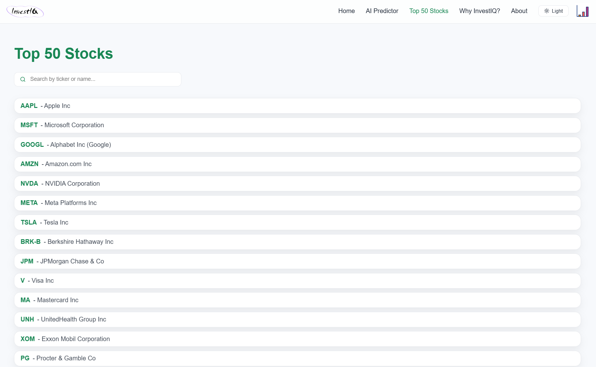
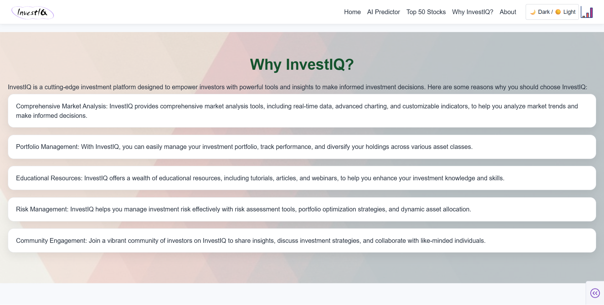
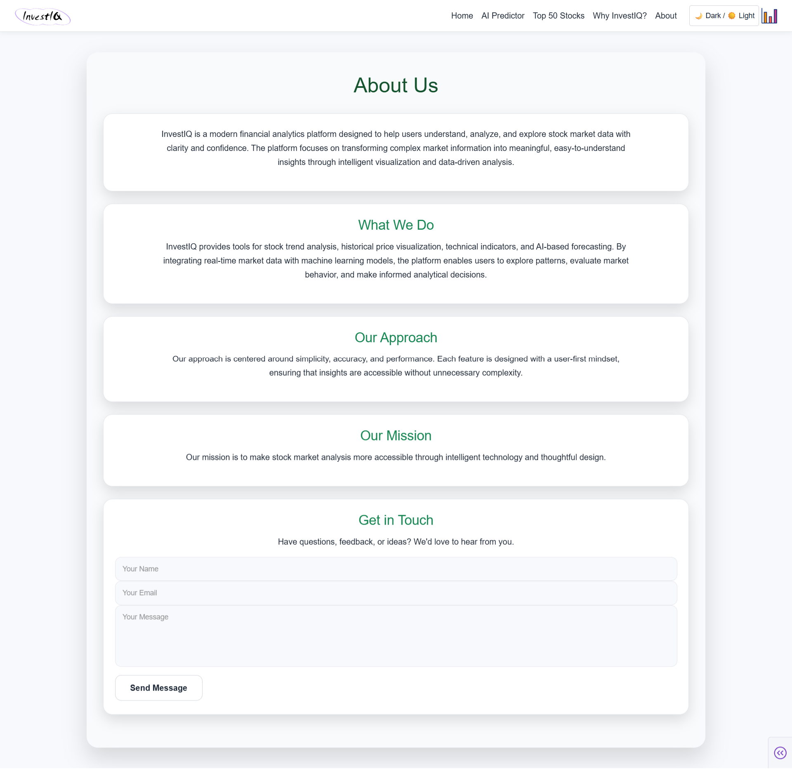

# InvestIQ

### AI-Powered Stock Market Analytics & Forecasting Platform

 

*Intelligent market analysis · Interactive charting · ML-based forecasting*

---

## 📌 Overview

**InvestIQ** is a modern, full-stack AI-powered stock market analytics platform that combines real-time financial data, interactive charting, technical indicators, and machine learning-based forecasting all within a clean and professional UI.

Whether you're exploring historical price trends or projecting future movements, InvestIQ delivers actionable insights through a smooth, responsive experience.

> **Focus areas:** Clean financial insights · Interactive analytics · AI-assisted forecasting · Modern visualization

---

## ✨ Features

### 📈 Real-Time Stock Analytics
- Live stock data retrieval via `yfinance`
- Historical price visualization with smooth transitions
- Interactive candlestick chart rendering
- EMA (Exponential Moving Average) overlays

### 🤖 AI-Based Forecasting
- Machine learning prediction engine (scikit-learn)
- Recursive multi-day forecasting with model caching
- Historical trend learning & visualization
- Animated loading states with error handling

### 🎨 Modern UI/UX
- Dark / Light theme toggle
- Premium interaction experience with Framer Motion animations
- Theme-aware graph rendering via Plotly.js

---

## 🛠 Tech Stack

### Frontend
| Technology | Purpose |
|---|---|
| React 19 + Vite | UI framework & build tool |
| Tailwind CSS | Utility-first styling |
| React Router DOM | Client-side routing |
| Framer Motion | Animations & transitions |
| Plotly.js | Interactive financial charts |
| Axios | HTTP client |
| Lucide React | Icon library |

### Backend
| Technology | Purpose |
|---|---|
| FastAPI | High-performance REST API |
| yfinance | Stock data retrieval |
| pandas & numpy | Data processing |
| scikit-learn | ML forecasting engine |
| Python (Uvicorn) | ASGI server |

---

## 🖼 Screenshots

### 🏠 Home Page

  

### 🤖 AI Predictor

  

### 📊 Top 50 Stocks

  

### 💡 Why InvestIQ?

  

### 👤 About Page

  

---

## ⚠️ Disclaimer

> InvestIQ is intended **for educational and analytical purposes only.**
>
> This platform does **not** provide financial advice, investment recommendations, or trading guarantees. Past performance is not indicative of future results.
>
> **Always consult a certified financial advisor before making any investment decisions.**

---

## 👨‍💻 Author

Developed with by **Shahiduddin**

*If you found this project useful, consider giving it a ⭐ — it means a lot!*

